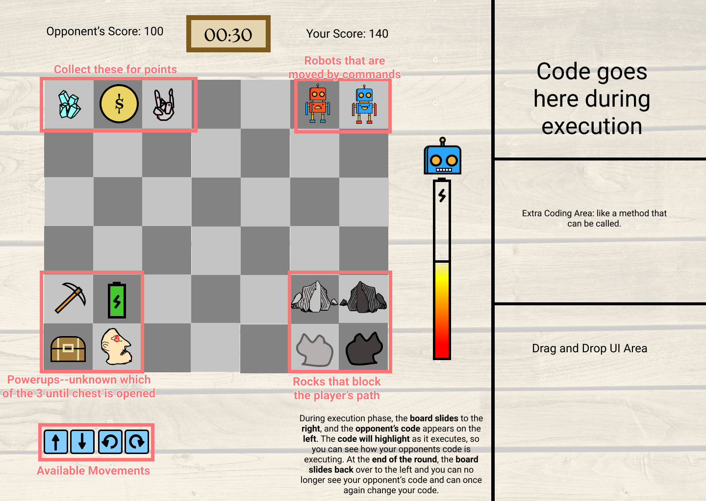

# Hacman!

[Link to Server](https://cs130-hacman.herokuapp.com/)

Current UI designs: https://www.figma.com/file/Eskv7tYWYoTTgUo6klOMnY/Hacman?node-id=16%3A2

# How to run this game
1. `git clone` the repo
2. Import everything in the client folder into Unity
3. `npm install` and `npm run watch-node` in the server folder!
4. Press run on the middle top Play button in Unity

Yayyy it should work :)

# Stack
## Client
Unity
## Server
Travis CI for continuous integration
Heroku for continous deployment
Node + typescript stack
